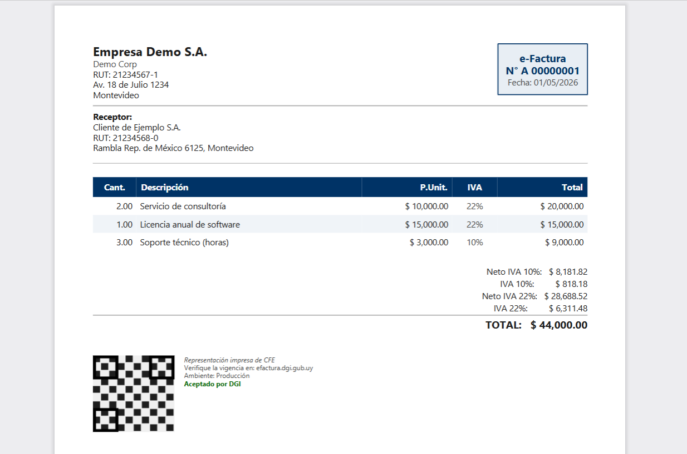

# FluentReport


[](https://github.com/MathiasGonzalez/FluentReport/actions/workflows/ci.yml)
[](https://github.com/MathiasGonzalez/FluentReport/actions/workflows/nuget.yml)
[](https://www.nuget.org/packages/FluentReport.Core)
[](https://www.nuget.org/packages/FluentReport)
[](https://www.nuget.org/packages/FluentReport.Excel)
[](https://www.nuget.org/packages/FluentReport.Html)
[](https://www.nuget.org/packages/FluentReport.Rdlc)

.NET 10 library for generating PDF, Excel, and HTML reports using a fluent C# API.

## Packages

| Package | Description |
|---------|-------------|
| [`FluentReport`](https://www.nuget.org/packages/FluentReport) | PDF renderer (SkiaSharp — Linux compatible) |
| [`FluentReport.Excel`](https://www.nuget.org/packages/FluentReport.Excel) | Excel (.xlsx) renderer (ClosedXML) |
| [`FluentReport.Html`](https://www.nuget.org/packages/FluentReport.Html) | HTML/email renderer (inline styles) |
| [`FluentReport.Rdlc`](https://www.nuget.org/packages/FluentReport.Rdlc) | RDLC/SSRS importer |
| [`FluentReport.Core`](https://www.nuget.org/packages/FluentReport.Core) | Core model without rendering dependencies — install directly only if implementing a custom renderer |

## Supported targets

| Feature | PDF | HTML | Excel | RDLC import |
|---------|:---:|:----:|:-----:|:-----------:|
| Text & fonts | ✓ | ✓ | ✓ | ✓ |
| Tables | ✓ | ✓ | ✓ | ✓ |
| Column / Row layout | ✓ | ✓ | ✓ | — |
| Images | ✓ | ✓ | — | ✓ |
| Borders & backgrounds | ✓ | ✓ | ✓ | ✓ |
| Lines & spacers | ✓ | ✓ | ✓ | ✓ |
| Header / Footer | ✓ | ✓ | ✓ | ✓ |
| Multi-page | ✓ | ✓ (page-break) | ✓ (→ sheets) | ✓ |
| Page sizes & margins | ✓ | ✓ | — | ✓ |
| Custom fonts | ✓ | ✓ | — | — |
| Linux compatible | ✓ | ✓ | ✓ | ✓ |

## Installation

```shell
dotnet add package FluentReport           # PDF
dotnet add package FluentReport.Excel     # + Excel
dotnet add package FluentReport.Html      # + HTML/email
dotnet add package FluentReport.Rdlc      # + RDLC import
```

## Quick start

```csharp
using FluentReport;
using FluentReport.Core;

Document.Create(container =>
{
    container.Page(page =>
    {
        page.Size(PageSizes.A4);
        page.MarginAll(40);

        page.Header()
            .Text("My Report")
            .FontSize(20).Bold().AlignCenter();

        page.Content().Column(col =>
        {
            col.Spacing(8);
            col.Item().Text("Summary").FontSize(14).Bold();
            col.Item().Line(1);

            col.Item().Table(table =>
            {
                table.ColumnsDefinition(cols =>
                {
                    cols.RelativeColumn(2);
                    cols.RelativeColumn(1);
                });
                table.Header(h =>
                {
                    h.Cell().Background("#4472C4").Padding(5).Text("Product").Bold().Color("#FFFFFF");
                    h.Cell().Background("#4472C4").Padding(5).Text("Price").Bold().Color("#FFFFFF");
                });
                table.Cell().Padding(5).Text("Widget A");
                table.Cell().Padding(5).Text("$9.99");
            });
        });

        page.Footer().AlignCenter().Text(x =>
        {
            x.Span("Page ");
            x.CurrentPageNumber();
            x.Span(" of ");
            x.TotalPages();
        });
    });
})
.GeneratePdf("report.pdf");
```

For Excel, HTML, and RDLC usage see the individual package READMEs:
[FluentReport.Excel](src/FluentReport.Excel/README.md) · [FluentReport.Html](src/FluentReport.Html/README.md) · [FluentReport.Rdlc](src/FluentReport.Rdlc/README.md)

### Example output — e-Factura (Uruguay)




## Page sizes

| Constant | Size (pt) |
|----------|-----------|
| `PageSizes.A4` | 595 × 842 |
| `PageSizes.A3` | 842 × 1191 |
| `PageSizes.A5` | 420 × 595 |
| `PageSizes.Letter` | 612 × 792 |
| `PageSizes.Legal` | 612 × 1008 |

Use `.Landscape()` to swap width and height, or `page.Size(width, height)` for a custom size.

## Documentation

- [API reference](docs/api.md) — all builders and methods
- [RDLC limitations](docs/rdlc-limitations.md) — known constraints and processing flow
- [UY fiscal document samples](docs/uy-fiscal-samples.md) — salary slip, delivery note, payment receipt

## Project structure

```
src/
├── FluentReport/          # PDF renderer (SkiaSharp)
├── FluentReport.Core/     # Core model and fluent API
├── FluentReport.Excel/    # Excel renderer (ClosedXML)
├── FluentReport.Html/     # HTML renderer
└── FluentReport.Rdlc/     # RDLC importer
tests/
├── FluentReport.Tests/
├── FluentReport.Excel.Tests/
├── FluentReport.Html.Tests/
└── FluentReport.Rdlc.Tests/
samples/
└── FluentReport.Samples/  # Sample documents (PDF, Excel, HTML)
docs/
├── api.md
├── rdlc-limitations.md
└── uy-fiscal-samples.md
```

## Dependencies

- [SkiaSharp](https://www.nuget.org/packages/SkiaSharp) 3.116.1 — PDF rendering
- [ClosedXML](https://www.nuget.org/packages/ClosedXML) 0.102.2 — Excel rendering

